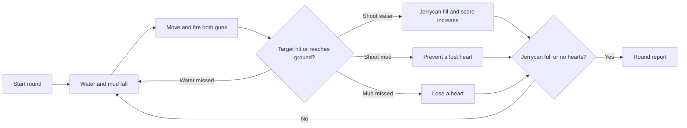

# Game Plan: *Water Defender*

> A browser arcade shooter about protecting clean water: aim two water guns at falling water drops
> and mud, fill the jerrycan, and personalize the shooter with an optional camera photo.

---

## 1. High-Concept Pitch

*Water Defender* is a small playable prototype inspired by clean-water access and contamination
prevention. The player moves a two-gun character left and right, shoots clean-water drops to fill a
jerrycan, and shoots falling mud before it reaches the ground. An optional camera portrait puts a
user-selected crop on the character's face; it is cosmetic and never controls play.

**Genre:** Arcade target shooter
**Platform:** Web (HTML canvas), keyboard-first
**Tone:** Hopeful, respectful, and focused on clean water

---

## 2. Core Game Loop



1. **Aim** — move the shooter horizontally with the left and right arrow keys.
2. **Fire** — hold Space to fire a water projectile from each gun.
3. **Protect the supply** — water hits fill the jerrycan; mud that lands costs one heart.
4. **Finish the round** — fill the jerrycan or lose all three hearts to reach the report screen.
5. **Track impact** — score contributes to the locally stored community-liter total.

---

## 3. Player Interaction & Controls

| Action | Input | Effect |
|---|---|---|
| Move left / right | `←` / `→` | Steer the shooter across the playfield |
| Fire both guns | Hold `Space` | Repeatedly send two projectiles upward |
| Start / continue | `Space`, `Enter`, or click | Start a round or continue after the report |
| Choose portrait crop | **Whole face**, **Eyes**, or **Mouth** | Choose which centered square camera crop appears on the character |
| Take / retake portrait | **Take face photo** / **Retake face** | Open the camera preview; capture when ready |

The face-part choice changes the crop region and zoom; it does not automatically detect or isolate
facial features. The photo is optional, cosmetic, held in page memory, and cleared on reload. The
camera stream stops immediately after capture. Movement is never camera-controlled.

---

## 4. Visual Layout (Screen Mockup)

```
┌───────────────────────────────────────────────────────────────────┐
│ charity: water                   Day 1                             │
├───────────────────────────────────────────────────────────────────┤
│ Jerrycan: ▓▓░░░░░░░░ 20%          Score: 20          Hearts: ♥♥♥    │
├───────────────────────────────────────────────────────────────────┤
│         💧 water drop                       ● mud                   │
│                       ↑ ↑ projectiles                             │
│                       🔫🙂🔫 shooter                                │
├───────────────────────────────────────────────────────────────────┤
│ Community Well Progress: ▓▓▓░░░░░░░  32%                           │
└───────────────────────────────────────────────────────────────────┘
│ Use [Whole face] [Eyes] [Mouth]  [Take face photo] [camera preview] │
```

A full SVG mockup is included at [assets/gameplay-mockup.svg](../assets/gameplay-mockup.svg) and the
title screen mockup at [assets/title-screen-mockup.svg](../assets/title-screen-mockup.svg).

### Screen inventory
- **Title Screen** — Water Defender title, clean-water drop mark, and keyboard/click start prompt.
- **Gameplay Screen** — jerrycan fill, score, hearts, falling water and mud, twin-gun shooter, and
  community progress meter.
- **Shooter photo controls** — browser camera permission, live preview, face-part crop selector,
  capture/retake button, and a small portrait preview below the game canvas.
- **Round Report** — water collected, score, estimated liters, and a prompt to continue.

---

## 5. Visual Feedback Systems

| Player State | Feedback |
|---|---|
| Water target hit | Score and jerrycan fill increase |
| Mud target missed | One heart is removed |
| Round completed | Report shows score, jerrycan fill, and estimated liters |
| Portrait captured | Chosen crop appears inside the shooter's face outline; camera stream ends |

Color language draws directly from charity: water's palette — **primary blue (#2E9DF7)** for clean
water and calm states, **yellow (#FFC907)** for achievement/CTA/progress, and a desaturated
**brown/grey** for contamination or danger, ensuring accessibility contrast is maintained (feedback
is paired with icons/shapes, not color alone, for colorblind accessibility).

---

## 6. Scoring System

- **Water hit:** +10 score and +10 percentage points toward the jerrycan (up to 100%).
- **Missed water:** no penalty.
- **Missed mud:** −1 heart; the round ends when all three hearts are lost.
- **Round end:** a full jerrycan or zero hearts opens the report.
- **Estimated liters:** `score × 0.1`; this is a game estimate, not a donation or real-world impact
  calculation.
- **Community progress:** estimated liters are added to a persistent browser-local total against a
  5,000-liter display goal.

---

## 7. Round Progression

Each completed round advances the displayed day and slightly increases spawn frequency. Water
falls at 80–110 pixels per second and mud at 100–130 pixels per second, giving mud a modest speed
advantage. The spawn pool favors water two-to-one. The current prototype uses one playfield and
does not yet have terrain themes, touch controls, or pause/facts screens.

---

## 8. Charity: Water Branding Integration

- **Logo & Wordmark:** the current prototype uses a text credit only; use of official brand assets
  would need review against published guidelines and permission before public release.
- **Color Palette:** Blue #2E9DF7 (clean water / primary UI), Yellow #FFC907 (progress / CTA /
  celebration), White/off-white backgrounds for the "clean, optimistic" brand feel.
- **Typography:** clean sans-serif text keeps the title and HUD readable.
- **Jerrycan iconography:** the yellow jerrycan is the fill-meter accent.
- **Impact messaging:** the report contains an informational donation-model statement; it does not
  represent an actual donation or funded project.

---

## 9. AI-Assisted Brainstorm Notes

The current prototype is the falling water/mud shooter with twin guns, jerrycan scoring, and an
optional user-selected camera portrait. Possible future experiments include pipe-building puzzles,
well-building progression, short educational prompts, or cooperative community goals; none of
these are part of the current game.

---

## 10. Next Steps

1. Validate color/asset usage against charity: water's actual brand guidelines before any public
   release.
2. Test camera capture across browsers and devices; camera access requires permission and a secure
  context (HTTPS or localhost).
3. Add touch controls only after testing layout and gameplay on small screens.
4. Review the face-part crops with users and adjust framing if needed.
